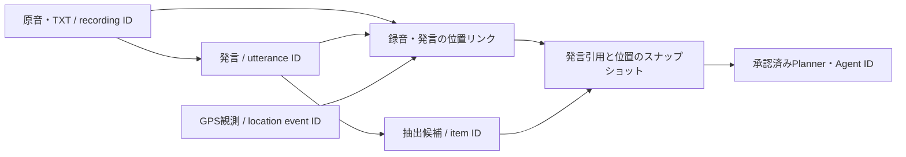

# 会話・GPS・次の行動のデータ設計

## 実装済みの流れ

1. MP3原音をSHA-256で重複排除し、`recordings.id`で保持する。TXTも原文を保存する。
2. 明示指定の録音日時、またはSoundcoreの未変更ファイル名の秒付き日時を取得し、`recorded_at_source`へ出典を保存する。ファイル名は日本時間として解釈する。日時不明時に取り込み時刻を代用しない。
3. iPhoneが取得したGPSは、取得時刻・座標・水平精度・概算位置フラグとともに`location_events.id`で保存する。オフライン中の取得も、同期後は取得時刻で照合する。
4. `conversation_location_links`が録音開始、または音声発言開始をGPSへ結び付ける。録音取り込み、音声解析完了、GPS同期、サーバー起動時、手動再照合で再計算する。GPS同期ではその時間範囲と重なる録音を再照合する。
5. 新規録音の自動整理、または旧録音の手動整理で、タスクなどの候補と発言根拠を保存する。GPSはCodexへ送らない。
6. 根拠APIに現在の位置コンテキストを付加する。候補をPlanner・Agentへ承認した時点、または発言を再解析で置き換える直前に、`conversation_item_evidence.context_snapshot`へコンテキストを固定する。後からGPSが増えても承認当時の根拠は上書きしない。

## 保存する関連と確からしさ

| データ | 主な参照・属性 | 役割 |
| --- | --- | --- |
| 録音 | ID、SHA-256、録音日時、日時の出典、原本 | 再解析できる一次資料 |
| 発言 | ID、録音ID、話者ID、音声内開始・終了秒、本文 | 会話内の根拠を特定 |
| GPS観測 | ID、取得時刻、座標、精度、概算位置フラグ | 取得した事実を保持 |
| 位置リンク | 録音ID、対象ID、発言ID、GPS ID、照合対象時刻、時刻の算出根拠、日時出典、時刻差、状態、方式版、照合日時 | 再計算可能な推定 |
| 候補と根拠 | 候補ID、録音ID、発言ID、引用・話者・時間のコピー、位置スナップショット | 判断理由を後から追跡 |
| 承認先 | `approved_target`、`approved_item_id` | 候補から実際のタスクへの対応 |

照合方式`nearest-gps-v1`は前後300秒以内、水平精度200 m以内、概算位置ではないGPSを対象にする。最小時刻差、水平精度、IDの順に選ぶ。GPSの座標はリンク先から取得し、互換用の録音座標カラムは派生キャッシュとして更新する。

状態は`matched_estimate`（推定で紐付け）、`unknown_time`、`no_nearby_gps`、`low_accuracy`を区別する。紐付けできない理由もデータとして残す。

発言時刻は録音開始＋音声内の経過秒で算出するため、`audio_offset_estimate`とする。録音の一時停止・編集・書き出し時の時間変換・機器の時計ずれは検証できず、確定した会話場所とは扱わない。録音開始の位置もiPhoneの位置からの推定であり、話者個人の位置を証明しない。TXTの行番号は発言時刻ではないため、TXTには録音単位のリンクだけを作り、根拠にもその粒度を残す。

既存の確認済み日時は出典を復元できないため`legacy_verified`と表示する。未確認日時は自動的に確定扱いへ変更しない。現在の位置リンクは再計算で更新されるため履歴台帳ではなく、過去の判断は固定した根拠から確認する。

## 暮らしの行動への接続（2026-09-07実装）

会話候補から、根拠を固定した調査・予定・タスク・プロフィールへ接続できる。人物は録音内で一度選択し、予定日時は抽出できた値を入力済みにして不足だけ補う。調査結果から次の行動へ進み、予定から準備・申込タスクを切り出せる。カレンダーへは初回許可後の端末更新時に追加・変更・中止を反映する。保存・通知・履歴の仕様と限界は[暮らしのアシスタント](life-assistant.md)を参照する。

## 残る拡張方針

- **予定・リマインダー**: 発言日時、抽出された予定日時、通知日時を別フィールドにする。相対期限の原文、解釈したタイムゾーン、確認状態を保存する。カレンダーへの登録は候補IDを冪等キーにし、プロバイダー名とイベントIDを対応付ける。変更・取り消しもこの対応から追跡する。
- **場所に応じた振り返り**: 座標と「自宅・職場・訪問先」などの場所IDを分ける。場所名への変換は派生データとし、ユーザーによる補正、根拠GPS、適用期間を残す。まず「この場所で話した会話・未完了タスク」を参照できる形が実用的。
- **人物ごとの履歴**: 録音内の話者IDと、録音をまたぐ人物IDを分け、ユーザーが本人を確認した対応だけを保存する。「田中さん」という同名だけで自動統合しない。依頼・約束・本人が明言した希望などは、発言根拠、記録日時、有効期間、確認状態を持つ事実として蓄積する。
- **再解析・訂正**: 将来、解析実行ID、モデル・プロンプト版、元音声の時間軸との対応を発言に付加する。訂正前の抽出結果と外部イベントを一括上書きせず、根拠のスナップショットと新しい候補の差分から更新を判断する。

日時確認画面、EventKitへの登録、根拠への導線、明示的な人物プロフィールは実装済み。上記のうち外部との双方向同期、場所名管理、GPSのLLM送信、人物の自動同定は追加していない。

生活上の改善目標、条件付きの効果試算、確認負担、6週間の評価方法は[生活改善の設計](conversation-value-design.md)を参照する。そこに記載した数値は未計測の仮説である。
